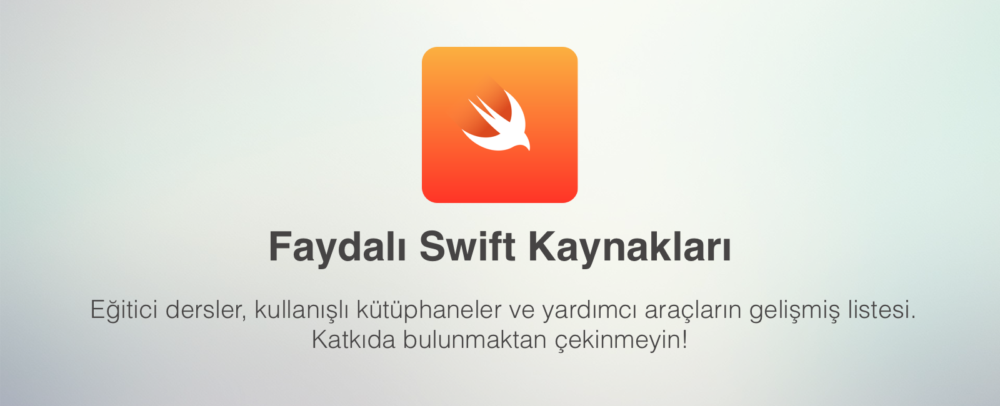

# Hakkında
iOS geliştirme için birçok kaynak var fakat verimli ve güncel kaynakları bulmak/takip etmek epeyce emek gerektiriyor. Bu reponun amacı, Türkiye'deki geliştiriciler için faydalı olabilecek kaynakları bir araya toplarlamak ve referans yorumlarıyla geliştiricinin kaynak hakkında bilgi edinmesini sağlamaktır.

Kaynaklara yazılmış açıklama notları sayesinde kaynak hakkında önbilgiye sahip olabilirsiniz.

## Dersler
- [Stanford Swift Cources](https://www.youtube.com/playlist?list=PL3d_SFOiG7_8ofjyKzX6Nl1wZehbdiZC_) - Standford Ünivesitesi'nin Swift dersleri profesyonel çekim ile eğitici video serisi haline getirilmiş.
- [Code with Chris - Chris Ching](https://codewithchris.com/how-to-make-an-iphone-app/) - Başlangıç düzeyindeki geliştiriciler için hazırlanmış Swift eğitim video serisi. Video süresince birkaç kütüphane ve araca da değiniyor.
- [Swift Language](https://www.youtube.com/playlist?list=PLxwBNxx9j4PUpjCEVwjqFvNecNvQ6Dj6G) - 400'den fazla Swift videosu ile çok farklı konularda bilgi edinebileceğiniz video serisi. Swift 1, Swift 2 ve Swift 3 içerdiği için videolardaki kodlar güncel olmayabilir.
- [Lets Build That App](https://www.letsbuildthatapp.com/) - Popüler uygulamaların clone'ları üzerinden video eğitim serileri barındırıyor.
- [Design+Code](https://designcode.io/courses/) - Giriş düzeyindeki öğreniciler için farklı konularda eğitim veren bir eğitim sitesi. SwiftUI için de eğitici dersler mevcut.

## Bloglar
- [Swift Programming - Santosh Rajan](https://medium.com/swift-programming/1-learn-swift-by-running-scripts-73fdf8507f4b) - Giriş düzeyindeki geliştiriciler için hazırlanmış bir yazı dizisi.
- [We ❤️ Swift](https://www.weheartswift.com) - Swift ile alakalı birden fazla konuya, kütüphaneye ve kod örneğine değinen bir blog sitesi. 
- [NSIstanbul](https://medium.com/nsistanbul) - NSIstanbul topluluğunun üyeleri tarafından içerik oluşturulan bir Medium yayını. Ağırlıklı olarak Türkçe içerikler yer alıyor ve farklı konulara değiniyor.
- [Litle Bites Of Cocoa](https://littlebitesofcocoa.com/) - iOS ve MacOS geliştiricileri için çok fayda konuda ipucu ve teknik bilgi içeren bir blog sitesi.
- [Ray Wenderlich](https://www.raywenderlich.com/category/swift) -  iOS geliştirme ile ilgili podcast, video içerik ve blog içerikleri üreten bir oluşum. Çok farklı konularda detaylı anlatımlar yapıyorlar. Ayrıca içerikleri sürekli güncel tutmaları da bu oluşumu daha başarılı kılıyor.
- [Kenan Atmaca](http://kenanatmaca.com/) - iOS geliştirme ile Türkçe içerik üreten en kaliteli bloglardan birisi. Kenan hem güncel teknolojilere değiniyor hem de sık sık içerik üretiyor.
- [Halil Özel](https://medium.com/@halilozel1903) - iOS uygulama geliştirme ile ilgili Türkçe içerikler üreten bir blog yazarıdır. Sık sık iOS uygulama geliştirmeyle alakalı yazılar yazmaktadır.
- [TurkishKit](https://medium.com/turkishkit) - iOS programlama ile ilgili sıklıkla blog yazıları paylaşılan bir blog. Türkçe içerikler üretilmektedir.
- [iOS Notları](https://iosnotlari.com/dersler/) - iOS uygulama geliştirme ile Türkçe içerik üreten bir blog sitesidir. Güncel konularda blog yazıları yayınlanmaktadır.
- [Hacking with Swift](https://www.hackingwithswift.com/) - Özellikle SwiftUI üzerine detaylı ve eğitici içerikler bulabileceğiniz blog sitesi.

## Podcastler

- [Swifthane](https://swifthane.com) - swift hakkında çeşitli konuların, çeşitli konuklarla değerlendirilip, tartışıldığı ve Ali Can Batur ile Ahmet Yalçınkaya tarafından yürütülen bir podcast serisidir.

## Youtube 
- [Archetapp - Jared Davidson](https://www.youtube.com/channel/UCDIBBmkZIB2hjBsk1hUImdA) - Jared, uzun süredir Swift ile alakalı bilgilendirici içerikler üretiyor. Samimi ve detaylı anlatımı ile, Swift kategorisinde takip edilmesi gereken Youtube kanallarının başında geliyor.
- [Burak Gökçınar](https://www.youtube.com/channel/UCz0MSOy_CIt32ISVz4KPnFA) - Burak, az bilinen konulara değiniyor ve Türkçe içerikler üretiyor.
- [Brian Advent](https://www.youtube.com/channel/UCysEngjfeIYapEER9K8aikw) - Brian, düzenli olarak video üretiyor ve güncel teknolojileri, kütüphaneleri sık sık kullanıyor.
- [Duc Tran](https://www.youtube.com/channel/UCvPFGq6luCqAVGiFpzTvkIA/videos) - Kanal, hemen hemen her konuda içerik üretmeye çalışıyor. Son zamanlarda içerik üretim istikrarı biraz kaybolsa da takip edilmeli.
- [Late Night Muhabbetleri](https://www.youtube.com/channel/UCjVMKSrhru8KSirbfzzFHpw) - Ilter Cengiz ve Göksel Köksal tarafından hazırlanan, ilk sezonu Mimari ve Moduler App yapısı üzerine olan Youtube serisidir.
- [Lets Build That App](https://www.youtube.com/channel/UCuP2vJ6kRutQBfRmdcI92mA/videos) - Sosyal medya ve blog sitesini de çok aktif kullanan bir ekibin Youtube kanalı. Çok fazla sayıda bilgilendirici içerik üretiyorlar.
- [Paul Hudson](https://www.youtube.com/channel/UCmJi5RdDLgzvkl3Ly0DRMlQ) - Hacking with Swift'in kurucusu olan Paul, son dönemlerde SwiftUI üzerine faydalı içerikler üretiyor.

## Araçlar
- [UIColor](http://uicolor.xyz/#/hex-to-ui) - Elinizdeki HEX ya da RGB rengi UIColor'a çeviren bir araç.
- [WTF?](https://www.wtfautolayout.com/) - Constraint hatalarını görselleştirmeyi sağlayan bir araç Özellikle auto layout kullanmaya yeni başlayan geliştiriciler için oldukça faydalı.
- [DaVinci Apps](https://davinciapps.com/) - Uygulamalarınız için şık ekran görüntüleri hazırlamanıza olanak veren bir site. Özellikle kişisel projelerde çok iş görüyor.

## Çeşitli
- [iOS & Swift Tüyolar](https://github.com/uy/iOS-Swift-Little-Tricks) - iOS için takip edilebilecek, ufak ama yararlı geliştirmeleri barındırıyor.
- [Awesome Swift](https://github.com/matteocrippa/awesome-swift) - Swift ile yazılmış birçok faydalı kütüphane listesi.
- [Awesome iOS](https://github.com/vsouza/awesome-ios) - iOS geliştirme yaparken kullanabileceğiniz pek çok faydalı kütüphane ve component listesi.
- [Swift 101](https://github.com/halilozel1903/Swift101) - Swift programlamanın temelleri hakkında çeşitli bilgi ve örnekler içeren bir projedir.
- [iOSProjects](https://github.com/halilozel1903/iOSProjects) -  Swift diliyle geliştirilmiş olan birbirinden farklı uygulamaları içeren bir projedir.

## Stil Kılavuzları
Bazı gruplarca/şirketlerce belirlenmiş çeşitli geliştirme standartları. 
- [Ray Wenderlich](https://github.com/raywenderlich/swift-style-guide)
- [GitHub](https://github.com/github/swift-style-guide)
- [Linkedin](https://github.com/linkedin/swift-style-guide)
- [Wordpress Mobile](https://github.com/wordpress-mobile/swift-style-guide)
- [Coursera](https://github.com/coursera/swift-style-guide)
- [Metova](https://github.com/metova/swift-style-guide)
